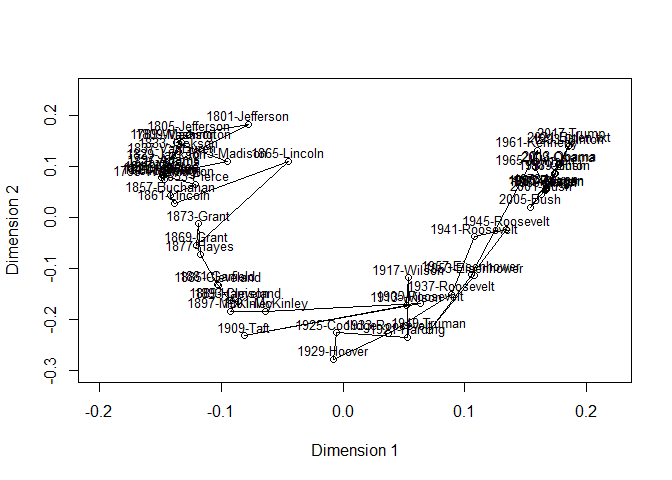

<!-- README.md is generated from README.Rmd. Please edit that file -->

# poisrrr

The package poisrrr implements the Poisson Reduced Rank method
introduced in [C. Jentsch, E. R. Lee and E. Mammen (2020) Time-dependent
Poisson reduced rank models for political text data analysis.
Computational Statistics and Data Analysis, 142,
106813](https://doi.org/10.1016/j.csda.2019.106813). See also [C.
Jentsch, E. Mammen and E. R. Lee (2021) Poisson reduced rank models with
an application to political text data. Biometrika, 108, 2, 455 -
468](https://doi.org/10.1093/biomet/asaa063)

## Installation

You can install the development version from
[GitHub](https://github.com/) with:

``` r
# install.packages("remotes")
remotes::install_github("chroetz/poisrrr")
```

## Example

Create a Term-Document-Matrix form quanteda’s inaugural address corpus.

``` r
library(tidyverse)
#> -- Attaching packages --------------------------------------- tidyverse 1.3.1 --
#> v ggplot2 3.3.5     v purrr   0.3.4
#> v tibble  3.1.3     v dplyr   1.0.7
#> v tidyr   1.1.3     v stringr 1.4.0
#> v readr   2.0.0     v forcats 0.5.1
#> -- Conflicts ------------------------------------------ tidyverse_conflicts() --
#> x dplyr::filter() masks stats::filter()
#> x dplyr::lag()    masks stats::lag()
quanteda::data_corpus_inaugural %>% 
  quanteda::tokens(remove_punct = TRUE, remove_symbols = TRUE, remove_numbers = TRUE) %>% 
  quanteda::dfm(verbose = FALSE) %>% 
  as.matrix() %>% 
  t() ->
  tdm
tdm <- tdm[rowSums(tdm) > 5, ] # remove rare words
```

Apply the method in for Dimension 2 and plot the resulting plane of
documents.

``` r
library(poisrrr)
K <- 2
theta <- estim(tdm, K, verbose=FALSE)
lst <- theta2plist(theta, K)
v <- lst$v
plot(NA, xlim=c(-0.2, 0.22), ylim=c(-0.3, 0.25), xlab="Dimension 1", ylab="Dimension 2")
points(v)
lines(v)
text(v, labels=rownames(v), cex=0.8, pos=3, offset=0.2)
```


